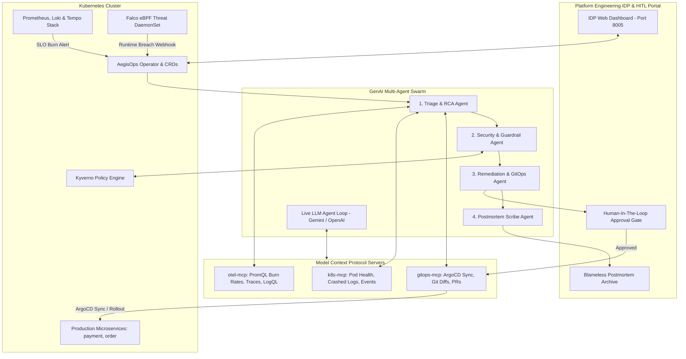

# 🛡️ AegisOps — Autonomous Agentic SRE & Self-Healing Platform Control Plane

[](https://kubernetes.io/)
[](https://opentelemetry.io/)
[](https://modelcontextprotocol.io/)
[](https://kyverno.io/)
[](https://falco.org/)
[](https://python.org/)
[](https://fastapi.tiangolo.com/)

**AegisOps** is an enterprise-grade autonomous Site Reliability Engineering (SRE) and Internal Developer Platform (IDP) control plane. When anomalies, SLO error budget burns, or Kubernetes failures occur, an ensemble of **GenAI Agents** queries cluster state and telemetry via **Model Context Protocol (MCP)** servers, deduces the technical root cause, evaluates security blast radius, formulates a validated **GitOps Pull Request**, and safely reconciles the cluster with **Human-in-the-Loop (HITL)** approvals before auto-generating a **Google SRE standard blameless postmortem**.

---

## 📖 What Does "AegisOps" Mean?

* **Aegis** (*Ancient Greek: αἰγίς*): The mythical, impenetrable shield carried by Athena (Goddess of Wisdom & Strategy) and Zeus, symbolizing **divine protection, invulnerability, and proactive defense**.
* **Ops** (*Operations*): The industry standard for DevOps, SRE, SecOps, and Platform Engineering.
* **AegisOps**: **The Autonomous Shield and Intelligent Guardian of Cloud Operations**.

---

## 🏛️ System Architecture



---

## 🌟 The 7 Foundational Pillars

| # | Pillar | Implementation in AegisOps | Key Technologies |
|---|---|---|---|
| **1** | **SRE Operations** | Multi-window burn rate alerts ($1\text{h}>14.4\times$, $6\text{h}>6.0\times$), error budgets, blameless postmortems | Google SRE Workbook, PrometheusRule |
| **2** | **Kubernetes** | Custom CRDs (`SLOPolicy`, `InvestigationRun`, `RemediationPlan`), Kopf Operator | Kubebuilder / Kopf, Kubernetes Go SDK |
| **3** | **Observability** | Correlated M.E.L.T. (PromQL metrics, LogQL logs, Tempo TraceQL waterfall) | OpenTelemetry, Prometheus, Loki, Tempo |
| **4** | **GenAI Multi-Agents** | 4-agent ensemble (Triage, Security, Remediation, Scribe) with confidence scoring | Python, Pydantic, Async State Machine |
| **5** | **Model Context Protocol** | Custom MCP Servers (`k8s-mcp`, `otel-mcp`, `gitops-mcp`) | Model Context Protocol (MCP) Python SDK |
| **6** | **DevSecOps** | Kyverno baseline policies, Falco runtime anomaly detection, blast-radius index | Kyverno, Falco, Deterministic Guardrails |
| **7** | **Platform Engineering** | Self-service developer IDP dashboard, visual diff HITL approval gate, GitOps sync | FastAPI, Tailwind CSS, ArgoCD GitOps |

---

## 🔌 How MCP Servers Connect with Models in Kubernetes

In a Kubernetes deployment, LLMs do not execute direct network requests to internal pods. Instead, the **Agent Orchestrator / MCP Host** manages the tool-calling loop:

```
                                  KUBERNETES CLUSTER
 ┌──────────────────────────────────────────────────────────────────────────────────────────────────┐
 │                                                                                                  │
 │                               ┌────────────────────────────────┐                                 │
 │                               │     Cloud or In-Cluster LLM    │                                 │
 │                               │ (Gemini, Claude, GPT, or vLLM) │                                 │
 │                               └──────────────▲─────────────────┘                                 │
 │                                              │ (1) Prompt + Tool Schemas                         │
 │                                              │ (2) LLM Returns: "Call get_pod_logs(previous=True)"│
 │                                              │ (5) Final Answer / Resolution Plan                │
 │                                              ▼                                                   │
 │                               ┌────────────────────────────────┐                                 │
 │                               │    Agent Host / Orchestrator   │                                 │
 │                               │     (AegisOps Control Plane)   │                                 │
 │                               └───────▲──────────────▲─────────┘                                 │
 │                                       │              │                                           │
 │                 MCP JSON-RPC over SSE │              │ MCP JSON-RPC over SSE                     │
 │          http://k8s-mcp:8080/sse      │              │ http://otel-mcp:8080/sse                  │
 │                                       ▼              ▼                                           │
 │                       ┌──────────────────┐        ┌──────────────────┐                           │
 │                       │  k8s-mcp-server  │        │ otel-mcp-server  │                           │
 │                       │   (Deployment)   │        │   (Deployment)   │                           │
 │                       └────────┬─────────┘        └────────┬─────────┘                           │
 │                                │ (K8s API)                 │ (PromQL / Tempo API)                │
 │                                ▼                           ▼                                     │
 │                       ┌──────────────────┐        ┌──────────────────┐                           │
 │                       │ Kube-API Server  │        │ Prometheus/Tempo │                           │
 │                       └──────────────────┘        └──────────────────┘                           │
 └──────────────────────────────────────────────────────────────────────────────────────────────────┘
```

### The 4-Step MCP Tool-Calling Loop:
1. **Tool Discovery (`tools/list`)**: The Agent connects to `k8s-mcp` and `otel-mcp`, retrieving tool declarations (`get_pods`, `get_pod_logs`, `query_promql`, `get_trace_tree`).
2. **Schema Passing**: The Agent translates MCP schemas into function declarations passed to the LLM (Gemini / OpenAI / Claude).
3. **Model Decides Tool Call**: The LLM analyzes the alert and returns a structured call: `{"name": "get_pod_logs", "args": {"pod_name": "payment-service-857758575d-wql46", "previous": true}}`.
4. **In-Cluster Execution**: The Agent executes `k8s-mcp.call_tool(...)` using in-cluster `ServiceAccount` RBAC and feeds the logs back to the LLM until resolution.

---

## ⚙️ Two Deployment & Operational Modes

### 💻 Mode 1: Developer Feedback / Fast Iteration Mode (Local Mac + Kind Pods)
* **Goal**: Instant feedback, rapid agent prompt/logic refinement, zero CPU/RAM bloat.
* **Workload**: Real pods (`payment-service`, `order-service`) running in the `production` namespace on a local `kind` cluster.
* **Control Plane & Swarm**: Runs on Mac host via Python (`server.py` on `http://localhost:8005`).
* **Telemetry**: Managed via `otel-mcp` lightweight zero-overhead telemetry provider.

```
                  YOUR MAC HOST OS (Fast Execution)
 ┌─────────────────────────────────────────────────────────────┐
 │  • AegisOps IDP Web Server & Agents (server.py on :8005)    │
 │  • otel-mcp Zero-Overhead Telemetry Provider                │
 └──────────────────────────────┬──────────────────────────────┘
                                │ (~/.kube/config)
                                ▼
                 LOCAL KUBERNETES CLUSTER (Kind)
 ┌─────────────────────────────────────────────────────────────┐
 │  Namespace: `production`                                    │
 │  ├── payment-service pods (Real containers with OOMKills)   │
 │  └── order-service pods                                     │
 └─────────────────────────────────────────────────────────────┘
```

#### Step 1: Bootstrap the Local Cluster & Demo Pods
```bash
cd /Users/gangadharreddy/projects/ai-labs/aegisops
./scripts/setup_cluster.sh

# Verify pods are 1/1 Running in 'production'
kubectl get pods -n production
```

#### Step 2: Launch the IDP Control Plane Dashboard
```bash
./scripts/run_demo.sh
```
Open **`http://localhost:8005`** in your browser.

#### Step 3: Run Chaos Scenarios & Watch Live Healing
Open a separate terminal tab:

* **Scenario A: Memory Leak & Pod OOMKill**:
  ```bash
  # 1. Port-forward the payment service pod
  kubectl port-forward svc/payment-service 8000:8000 -n production

  # 2. Inject memory leak until Linux kernel OOMKill (SIGKILL exit 137)
  /Users/gangadharreddy/projects/ai-labs/.venv/bin/python chaos/trigger_oomkill.py
  ```
  *Watch the pod restart (`kubectl get pods -n production`) and see the alert pop up on [http://localhost:8005](http://localhost:8005).*

* **Scenario B: Falco Runtime Security Anomaly**:
  ```bash
  /Users/gangadharreddy/projects/ai-labs/.venv/bin/python chaos/trigger_security_anomaly.py
  ```
  *See the `FalcoRuntimeThreatDetected` security incident appear with a non-root hardening patch on [http://localhost:8005](http://localhost:8005).*

---

### 🏢 Mode 2: Full In-Cluster Production Setup

In Full Production Mode, every layer runs natively inside isolated Kubernetes namespaces:
* **`production`**: Microservices under management.
* **`aegisops-system`**: AegisOps Operator and IDP Portal deployments with RBAC ServiceAccounts.
* **`observability`**: Full Prometheus, Alertmanager, Grafana, Loki, and Tempo stack.
* **`kyverno` & `falco`**: Admission policy enforcement & eBPF runtime threat detection.

```
                      ENTERPRISE KUBERNETES CLUSTER
 ┌─────────────────────────────────────────────────────────────────────────┐
 │  Namespace: `aegisops-system`                                           │
 │  ├── aegisops-operator (Reconciles CRDs & coordinates agents)           │
 │  ├── aegisops-idp-portal (Serves Web UI on ClusterIP / Ingress :8005)   │
 │  └── aegisops-agent-sa (RBAC least-privilege ClusterRoleBinding)        │
 │                                                                         │
 │  Namespace: `observability`                                             │
 │  ├── Prometheus & Alertmanager (SLO multi-window burn rate alerts)      │
 │  ├── Grafana Loki (LogQL structured container log indexing)             │
 │  └── Grafana Tempo & OpenTelemetry Collector (TraceQL span waterfall)   │
 │                                                                         │
 │  Namespace: `kyverno` & `falco`                                         │
 │  ├── Kyverno Admission Controller & Background Scanner                  │
 │  └── Falco eBPF Driver & FalcoSidekick Webhook Dispatcher               │
 │                                                                         │
 │  Namespace: `production`                                                │
 │  └── payment-service & order-service (Restricted Pod Security)          │
 └─────────────────────────────────────────────────────────────────────────┘
```

#### Step 1: Deploy Operator & IDP Portal into `aegisops-system`
```bash
# 1. Apply CRDs, Namespaces and RBAC
kubectl apply -f k8s/base/namespace.yaml
kubectl apply -f k8s/crds/
kubectl apply -f k8s/base/rbac.yaml

# 2. Deploy AegisOps Operator & In-Cluster Portal
kubectl apply -f k8s/operator/

# 3. Verify operator running in aegisops-system
kubectl get pods -n aegisops-system
```

#### Step 2: Deploy Production Observability Stack via Helm
```bash
# 1. Add Prometheus Community Helm Repo
helm repo add prometheus-community https://prometheus-community.github.io/helm-charts
helm repo update

# 2. Install kube-prometheus-stack configured to webhook AegisOps Operator
helm upgrade --install kube-prometheus-stack prometheus-community/kube-prometheus-stack \
  --namespace observability \
  -f k8s/observability/helm-observability-values.yaml

# 3. Apply AegisOps SLO Burn Rate PrometheusRules
kubectl apply -f k8s/observability/prometheus-slo-alerts.yaml

# 4. Verify observability pods
kubectl get pods -n observability
```

#### Step 3: Deploy Security Stack (Kyverno & Falco)
```bash
# One-click security deployment
./scripts/setup_security_stack.sh
```

#### Step 4: Access the In-Cluster IDP Portal
```bash
kubectl port-forward -n aegisops-system svc/aegisops-idp-portal 8005:8005
```
Open **`http://localhost:8005`** in your browser.

---

## 🔒 DevSecOps: Kyverno & Falco Setup & Rules

### 1. Kyverno Policy Engine
Kyverno acts as the **Admission Controller & Guardrail Policy Gatekeeper** to ensure agent-generated patches and developer manifests comply with Pod Security Standards (Restricted).

#### Installation Commands:
```bash
# 1. Add Kyverno Helm repository
helm repo add kyverno https://kyverno.github.io/kyverno/
helm repo update kyverno

# 2. Install Kyverno in the 'kyverno' namespace
helm upgrade --install kyverno kyverno/kyverno \
  --namespace kyverno \
  --create-namespace \
  -f k8s/security/helm-kyverno-values.yaml

# 3. Apply AegisOps Guardrail Policies
kubectl apply -f k8s/security/kyverno-policies.yaml
```

#### Policies Enforced by AegisOps ([`kyverno-policies.yaml`](file:///Users/gangadharreddy/projects/ai-labs/aegisops/k8s/security/kyverno-policies.yaml)):
1. **`require-resource-limits`**: Rejects any deployment in `production` that lacks explicit CPU and memory requests/limits (preventing unconstrained memory leaks).
2. **`disallow-root-and-privileged`**: Blocks containers attempting to run as root (`UID 0`) or requesting `allowPrivilegeEscalation: true`.

#### Verification:
```bash
kubectl get clusterpolicy
kubectl describe clusterpolicy aegisops-guardrail-policies
```

---

### 2. Falco Runtime Threat Detection
Falco utilizes **eBPF (Extended Berkeley Packet Filter)** kernel instrumentation to detect anomalous system calls and privilege escalation in real time.

#### Installation Commands:
```bash
# 1. Add Falcosecurity Helm repository
helm repo add falcosecurity https://falcosecurity.github.io/charts
helm repo update falcosecurity

# 2. Install Falco with modern eBPF driver & FalcoSidekick
helm upgrade --install falco falcosecurity/falco \
  --namespace falco \
  --create-namespace \
  -f k8s/security/helm-falco-values.yaml
```

#### Falco Rules Active in AegisOps ([`falco-rules.yaml`](file:///Users/gangadharreddy/projects/ai-labs/aegisops/k8s/security/falco-rules.yaml)):
1. **Terminal Shell Spawned in Production Pod**:
   - **Trigger**: Process `bash`, `sh`, `zsh` spawned inside `production` namespace.
   - **Severity**: `CRITICAL`
2. **Sensitive Credential File Access**:
   - **Trigger**: Process attempts to read `/var/run/secrets/kubernetes.io/serviceaccount/token` or `.key`/`.pem` secrets.
   - **Severity**: `WARNING`

#### Webhook Integration with AegisOps:
FalcoSidekick is configured to automatically dispatch any `CRITICAL` or `WARNING` security alerts directly to the AegisOps IDP Control Plane endpoint (`http://aegisops-idp-portal.aegisops-system.svc.cluster.local:8005/api/incidents/trigger`), immediately spinning up the **Security & Guardrail Agent**.

---

## 🤖 Running the Multi-Agent Swarm

### A. Live Cloud Model Execution (Gemini API)
```bash
export GEMINI_API_KEY="your-gemini-api-key"
PYTHONPATH=. /Users/gangadharreddy/projects/ai-labs/.venv/bin/python agents/llm_agent_loop.py
```

### B. Standalone Deterministic Execution (Zero API Keys Needed)
```bash
PYTHONPATH=. /Users/gangadharreddy/projects/ai-labs/.venv/bin/python agents/orchestrator.py
```

---

## 🧪 Automated Test Suite

Run the full unit and integration test suite:
```bash
PYTHONPATH=. /Users/gangadharreddy/projects/ai-labs/.venv/bin/python -m pytest agents/tests/ -v
```

```text
============================== test session starts ==============================
agents/tests/test_agents.py::test_guardrail_blocks_dangerous_commands PASSED [ 14%]
agents/tests/test_agents.py::test_guardrail_evaluates_blast_radius PASSED [ 28%]
agents/tests/test_agents.py::test_guardrail_rejects_privileged_escalation PASSED [ 42%]
agents/tests/test_agents.py::test_triage_agent_rca PASSED                [ 57%]
agents/tests/test_agents.py::test_remediation_and_security_flow PASSED   [ 71%]
agents/tests/test_agents.py::test_scribe_agent_generates_valid_postmortem PASSED [ 85%]
agents/tests/test_agents.py::test_full_orchestrator_lifecycle PASSED     [100%]
============================== 7 passed in 0.30s ===============================
```

---

## 📑 Sample Blameless Incident Postmortem

When an incident is resolved, **`ScribeAgent`** automatically generates an audit-ready postmortem:

```markdown
# 📑 Blameless Incident Postmortem: INC-967EED2F

**Target Service**: `payment-service`  
**Namespace**: `production`  
**Incident Severity**: `P1 - CRITICAL (SLO Fast-Burn)`  
**Trigger Alert**: `PaymentServiceErrorBudgetFastBurn`  
**Status**: `RESOLVED & MITIGATED`  

## 🎯 Executive Summary
On 2026-08-26, payment-service experienced an acute SLO error budget burn rate exceeding critical thresholds (16.8x vs 14.4x limit), resulting in elevated p99 latency (3.45s) and HTTP 500 error cascades. AegisOps autonomous multi-agent swarm intercepted the alert, performed correlated multi-modal telemetry triage via MCP, deduced the root cause, formulated a validated GitOps remediation PR, and restored normal service health upon human approval.

## 🔍 Root Cause Analysis (RCA)
- **Primary Root Cause**: Memory leak triggered OOMKilled cascade due to recent aggressive memory limit reduction to 256Mi in commit 8f3b92c1.
- **Identified Culprit Artifact**: Commit 8f3b92c1 (memory limit 256Mi, DB pool 20)
- **Diagnostic Confidence Score**: 96%

## 🛡️ Remediation & Verification Summary
- **Action Applied**: ActionType.APPLY_GITOPS_PATCH
- **GitOps Pull Request**: https://github.com/aegisops/gitops-repo/pull/42
- **Security Audit Risk Score**: 4/10 (PASSED)
- **Rollback Safety Command**: kubectl rollout undo deployment/payment-service -n production
- **Post-Remediation Verification**: Telemetry confirmed 1-hour error budget burn rate returned to 0.2x, zero active OOMKills, and p99 latency stabilized below 80ms.
```

---

## ❓ Troubleshooting & SRE FAQ

#### Q: Why are Port 8000 and Port 8005 different?
* **Port 8000**: The target **payment-service pod** running inside Kubernetes (forwarded via `kubectl port-forward svc/payment-service 8000:8000`). Used for chaos injection.
* **Port 8005**: The **AegisOps SRE Control Plane & Web Portal** (`server.py`). Used for viewing live SLOs, approving GitOps PRs, and reading postmortems.

#### Q: How do I view logs of a crashed container when there are multiple pod replicas?
If you have multiple pod replicas, find the exact pod that restarted with `kubectl get pods -n production` and run:
```bash
kubectl logs pod/<crashed-pod-name> -n production --previous
```

---

## 📁 Repository Structure

```
aegisops/
├── README.md                           # Master Architecture, Quickstart & SRE Guide
├── apps/
│   ├── demo-services/                  # Instrumented microservices (payment & order services)
│   │   ├── payment-service/            # FastAPI + OTel + Prometheus + Chaos triggers
│   │   └── order-service/              # W3C trace context propagating gateway
│   └── idp-portal/                     # Platform Engineering IDP Dashboard (FastAPI + Tailwind)
│       └── server.py                   # Real-time incident & HITL control plane server (:8005)
├── mcp-servers/                        # Model Context Protocol (MCP) Servers
│   ├── fastmcp_compat.py               # FastMCP compatibility & JSON-RPC dispatcher
│   ├── k8s-mcp/server.py               # Kubernetes cluster operations MCP server
│   ├── otel-mcp/server.py              # OpenTelemetry metrics, logs & traces MCP server
│   └── gitops-mcp/server.py            # ArgoCD and GitOps manifest automation MCP server
├── agents/                             # Autonomous GenAI Multi-Agent Swarm
│   ├── core/                           # State models, guardrails & MCP tool client
│   ├── llm_agent_loop.py               # Live LLM Loop (Gemini / OpenAI + MCP tool calling)
│   ├── triage_agent.py                 # Multi-modal telemetry triage & hypothesis testing
│   ├── security_agent.py               # Blast-radius evaluation & Kyverno policy audit
│   ├── remediation_agent.py            # GitOps patch formulation & rollback planning
│   ├── scribe_agent.py                 # Automated Blameless Postmortem generator
│   ├── orchestrator.py                 # Multi-agent workflow loop & HITL coordinator
│   └── tests/test_agents.py            # Comprehensive test suite (7 tests passed)
├── operator/                           # Kubernetes Operator
│   ├── api/v1alpha1/                   # CRD specifications
│   ├── controllers/                    # Kopf reconciliation controller
│   └── main.go                         # Go controller entrypoint
├── k8s/                                # Production Kubernetes Manifests
│   ├── base/                           # Namespaces, RBAC ServiceAccounts & ClusterRoles
│   ├── crds/                           # SLOPolicy, InvestigationRun, RemediationPlan CRDs
│   ├── operator/                       # In-cluster Operator & IDP Portal deployment manifests
│   ├── observability/                  # Prometheus SLO alert rules & Helm values
│   ├── security/                       # Kyverno ClusterPolicies, Falco rules & Helm values
│   └── demo-apps/                      # Deployment & Service manifests (ConfigMap mounted)
├── chaos/                              # SRE Chaos Scenarios
│   ├── trigger_oomkill.py              # Memory leak -> OOMKill cascade + webhook alert
│   ├── trigger_db_pool_starvation.py   # Latency spike & 504 Gateway Timeouts + webhook alert
│   └── trigger_security_anomaly.py     # Suspicious shell / privilege escalation + webhook alert
└── scripts/                            # Automation & Setup
    ├── setup_cluster.sh                # Kind cluster bootstrap script
    ├── setup_security_stack.sh         # Kyverno & Falco one-click installer
    ├── run_demo.sh                     # Launch IDP Portal and demo
    └── teardown.sh                     # Cleanup script
```

---

## 📜 License
Apache 2.0 License. Built for cloud-native SRE, Kubernetes, and Agentic Platform Engineering.
